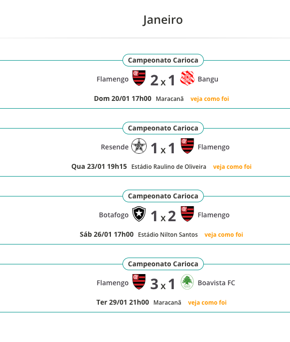
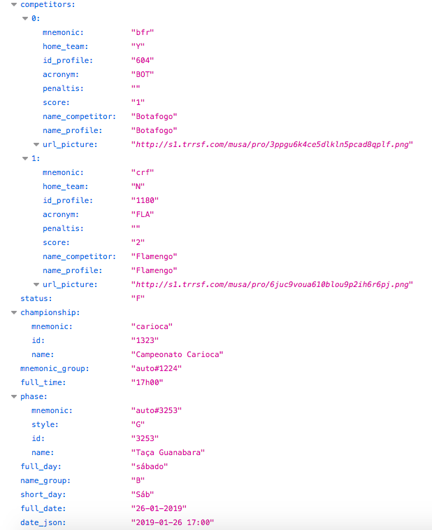

# Futebol-api
simple crawler for the matches list of Brazilian soccer teams.

- ### Requirements
  - [Node]((https://nodejs.org/en/download/)) > = 8.0
- ### Installation
    ```
    $ git clone git@github.com:LuizFelipeNeves/Futebol-api.git
    $ cd Futebol-api
    $ npm install
    ```
- ### Execution
    ```
        $ npm start
    ```
  Visit: `http://localhost:3000/framengo`

## API Methods
   | Method | Endpoint                       | Parameters       | Description                                                                                     
   | `GET`  | */:teamname*            | *name:* `string` | List all matches for the team.

## Screens


